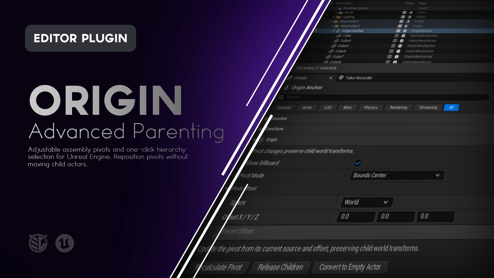
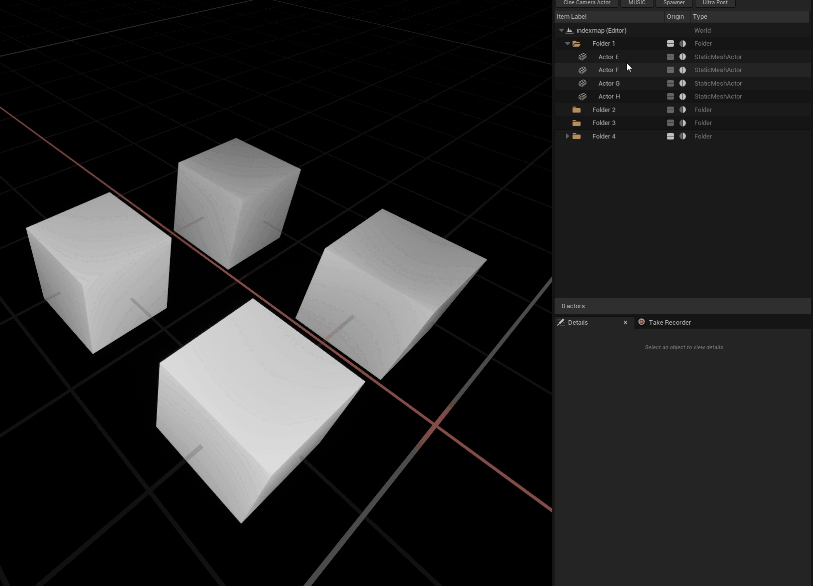
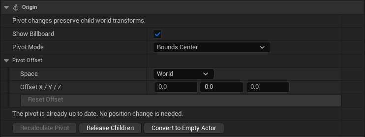
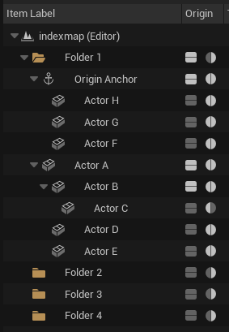
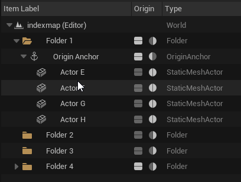

# Origin

**Adjustable assembly pivots and hierarchy controls for Unreal Engine.**

Origin lets you create an **Origin Anchor** above a group of Actors, giving the entire assembly a flexible pivot that can be repositioned without changing the world transforms of its children.

It also extends the World Outliner with one-click hierarchy selection tools and clearer visual feedback when parenting or deparenting Actors.




---

## What is Origin?

Unreal's attachment system makes it easy to parent Actors together, but the transform of that hierarchy is ultimately controlled by the pivot of its parent Actor.

That pivot is not always where you need it.

A doorway might need to rotate around its hinge. A modular room might need its pivot at a corner. A collection of props might need a temporary center point. A large assembly might need to be manipulated from its bottom instead of its geometric center.

Origin provides a dedicated **Origin Anchor** for that job.

Create an anchor above selected Actors, choose where its pivot should be, and manipulate the complete assembly through that anchor.

The pivot can later be repositioned without moving the attached Actors in world space.

Origin also adds hierarchy-selection controls and drag feedback directly to the World Outliner, making attachment hierarchies easier to navigate and understand.

---

# Features

### Origin Anchors

Create a dedicated transform parent above selected Actors while preserving their existing world transforms.

### Adjustable Assembly Pivots

Move an Origin Anchor's pivot without moving, rotating, or scaling its children in world space.

### Nine Pivot Modes

Choose from:

- Bounds Center
    
- Average Child Pivots
    
- Bottom Center
    
- Child Actor
    
- World Origin
    
- Custom Position
    
- Bounds Point
    
- Reference Actor
    
- Component / Socket
    

### Pivot Offsets

Add an additional position offset to any pivot mode using either:

- World space
    
- Anchor local space
    

### Assembly Transform

Move, rotate, or scale the Origin Anchor to manipulate the attached assembly as a unit.

### Viewport Billboard

Origin Anchors have an editor billboard so their pivot can be easily identified and selected in the viewport.

The billboard can be hidden per anchor when you want a cleaner viewport.

### Hierarchy Selection Controls

Select an Actor's:

- Immediate children
    
- All descendants
    
- Parent
    
- Siblings
    

directly from its World Outliner row.

### Folder Support

Hierarchy selection controls also work with World Outliner folders where appropriate.

### Parent / Deparent Feedback

Origin provides clear row highlighting when dragging Actors in the Outliner will change their hierarchy.

### Customizable Hierarchy Colors

Choose the colors used for:

- Parenting
    
- Deparenting
    

through Project Settings.

### Release or Convert Assemblies

Remove an Origin Anchor while either:

- Releasing its children back into the world
    
- Converting the anchor into a native empty Actor
    

### Undo / Redo

Origin operations participate in Unreal Engine's standard Undo and Redo workflow.

### Saved Pivot Settings

Origin Anchor settings are saved with the level.

---

> [!IMPORTANT]  
> **ATTENTION - README AUTHOR**
> 
> This should be the main demonstration of what Origin actually does.
> 
> **Recommended visual:** GIF
> 
> Show:
> 
> 1. Several Actors selected.
>     
> 2. Click **Create Origin Anchor**.
>     
> 3. Show the new anchor in the World Outliner.
>     
> 4. Move or rotate the anchor so the whole assembly moves together.
>     
> 5. Change the pivot mode or position.
>     
> 6. Show the pivot move while the child Actors remain stationary.
>     
> 7. Move or rotate the anchor again from its new pivot.
>     
> 
> Keep the example simple enough that the preserved child transforms are obvious.
> 
> Around 8 to 12 seconds would work well here.
> 
> **Suggested file:** `Doc/Images/Origin-Assembly.gif`
> 
> Once captured, replace this callout with:
> 
> ```
> 
> ```

---

# Using Origin

Origin has two primary workflows:

1. **Origin Anchors** for manipulating Actor assemblies.
    
2. **Hierarchy controls** for navigating and understanding attachment relationships in the World Outliner.
    

---

# Creating an Origin Anchor

Select the Actors you want to turn into an assembly.

Then click the **Create Origin Anchor** button beside the World Outliner search controls.

You can also use:

**Right-click Actor Selection > Origin > Create Origin Anchor**

Origin creates a new Anchor and attaches the selected Actors beneath it while preserving their world transforms.

The anchor begins at the **combined bounds center** of the selected assembly.

Actors that are already nested beneath another selected Actor retain that relationship.

For example:

```
Before:

Wall
Door
├── Handle
Lamp

After:

Origin Anchor
├── Wall
├── Door
│   └── Handle
└── Lamp
```

The relationship between `Door` and `Handle` remains intact.

---

## Creating an Empty Anchor

You can also create an Origin Anchor with nothing selected.

In this case, Origin creates an empty anchor at:

```
X: 0
Y: 0
Z: 0
```

Actors can then be attached to it normally.

---

## Keyboard Shortcut

Create Origin Anchor does not use a default keyboard shortcut.

You can assign one under:

**Editor Preferences > Keyboard Shortcuts > Origin**

This avoids replacing an existing Unreal Engine shortcut.

---

# Working with an Origin Anchor

Once an Origin Anchor has been created, select it and open the **Origin** category in the Details panel.

The Origin panel contains the controls used to configure the assembly pivot.



---

# Pivot Modes

Origin provides nine different ways to position an assembly pivot.

|Pivot Mode|Position|
|---|---|
|**Bounds Center**|Center of the combined world-space bounds of the assembly.|
|**Average Child Pivots**|Average world position of the anchor's direct child Actors.|
|**Bottom Center**|Center of the combined bounds in X and Y, positioned at the lowest point in Z.|
|**Child Actor**|Position of a selected direct child Actor.|
|**World Origin**|World position `0, 0, 0`.|
|**Custom**|Manually entered world-space X, Y, and Z coordinates.|
|**Bounds Point**|A configurable point on the assembly's world-space bounds.|
|**Reference Actor**|Position of another loaded Actor outside the assembly.|
|**Component / Socket**|Position of a Component or Socket on a selected direct child Actor.|

Changing to a valid pivot setting immediately repositions the Origin Anchor while preserving the world transforms of its children.

---

# Bounds Center

**Bounds Center** places the anchor at the center of the complete assembly.

Origin calculates the combined world-space bounds of the attached hierarchy.

This works well as the general-purpose default for assemblies.

---

# Average Child Pivots

**Average Child Pivots** calculates the average position of the anchor's direct children.

Each direct child contributes equally regardless of its physical size.

This can produce a different result from Bounds Center when the assembly contains Actors of significantly different sizes.

---

# Bottom Center

**Bottom Center** uses the center of the assembly in X and Y but positions the pivot at the lowest point of the combined bounds in Z.

This is useful for objects or assemblies that naturally need to sit on a surface.

Examples include:

- Furniture
    
- Props
    
- Buildings
    
- Modular environment pieces
    
- Large machinery
    

---

# Child Actor

**Child Actor** places the pivot at the world position of a selected direct child.

The child can be chosen using the Actor picker or viewport eyedropper.

This is useful when one Actor already represents the logical pivot of the assembly.

For example:

```
Origin Anchor
├── Door Frame
├── Door
└── Hinge
```

Using `Hinge` as the Child Actor gives the complete assembly a pivot at the hinge position.

---

# World Origin

**World Origin** places the pivot at:

```
0, 0, 0
```

The assembly remains where it currently is.

Only the Origin Anchor's position changes.

---

# Custom Position

**Custom** allows you to manually specify a world-space pivot position.

Enter:

- X
    
- Y
    
- Z
    

Coordinates are measured in centimeters using Unreal Engine's normal world coordinate system.

---

# Bounds Point

**Bounds Point** provides more control over the calculated bounds of the assembly.

Each world axis can independently use:

- Minimum
    
- Center
    
- Maximum
    

This allows the pivot to be placed on:

- Faces
    
- Edges
    
- Corners
    
- Center
    

Origin also includes several common presets:

- Center
    
- Top Center
    
- Bottom Center
    
- Min X Face
    
- Max X Face
    
- Min Y Face
    
- Max Y Face
    

This is particularly useful for modular environment work where pivots often need to sit on predictable edges or corners.

---

# Reference Actor

**Reference Actor** places the pivot at the position of another loaded Actor in the level.

The reference must exist outside the Origin Anchor's own assembly.

It can be selected using the Actor picker or viewport eyedropper.

This is useful when the logical pivot exists somewhere that is not represented by one of the assembly's children.

---

# Component / Socket

**Component / Socket** allows an Origin Anchor to use a position from inside one of its direct child Actors.

First choose the child Actor.

Then choose one of its Scene Components.

If that Component provides sockets, you can choose either:

- Component Origin
    
- A named Socket
    

Origin samples that position and uses it as the assembly pivot.

This allows much more precise alignment when an Actor already contains meaningful Component or Socket locations.

---

# Pivot Offset

Every pivot mode can receive an additional positional offset.

Expand **Pivot Offset** in the Origin panel.

You can choose between:

### World

Offset coordinates follow world axes.

### Anchor Local

Offset coordinates follow the Origin Anchor's rotation.

Anchor scale does not scale the offset distance.

The offset remains measured in centimeters.

---

## Reset Offset

Click:

**Reset Offset**

to return X, Y, and Z to zero while keeping the selected offset space.

---

# Recalculate Pivot

Origin does not continuously move an assembly pivot whenever its source changes.

For example, imagine an Origin Anchor using **Bounds Center**.

If you move one of its child Actors outward, the center of the assembly has changed, but the Origin Anchor does not automatically move.

Click:

**Recalculate Pivot**

to sample the current assembly and reposition the anchor.

The children remain in their current world positions.

The Recalculate Pivot button is disabled when:

- The pivot is already up to date
    
- A required source is unavailable
    
- The assembly cannot currently be modified
    
- The resulting position would not change
    

The status text and button tooltip explain why recalculation is unavailable.

---

# Viewport Billboard

Origin Anchors display an editor-only billboard at their position.

This makes the anchor easier to identify and select when its pivot is not directly on visible geometry.

You can enable or disable it using:

**Show Billboard**

in the Origin Details panel.

Hiding the billboard only changes the editor visualization.

It does not change the assembly.

---

# World Outliner Hierarchy Controls

Origin adds an **Origin** column directly after the Item Label column in the World Outliner.

This column provides four hierarchy-selection actions.

|Control|Selection|
|---|---|
|**Square - Top**|Immediate children|
|**Square - Bottom**|All descendants|
|**Circle - Left**|Parent|
|**Circle - Right**|Siblings|

These controls work with normal Actor hierarchies as well as Origin Anchor assemblies.

Unavailable actions are automatically dimmed.



---

## Selecting Immediate Children

Click the **top half of the square** to select the clicked row's immediate children.

For example:

```
Building
├── Floor
├── Walls
│   ├── Wall_A
│   └── Wall_B
└── Roof
```

Using Immediate Children on `Building` selects:

```
Floor
Walls
Roof
```

It does not select `Wall_A` or `Wall_B`.

---

## Selecting All Descendants

Click the **bottom half of the square** to select everything beneath the clicked row.

Using All Descendants on `Building` would select:

```
Floor
Walls
Wall_A
Wall_B
Roof
```

The hierarchy does not need to be expanded for these Actors to be found.

---

## Selecting the Parent

Click the **left half of the circle** to select the clicked row's parent.

The parent may be:

- An Actor
    
- A Folder
    

The World root is not presented as a selectable parent.

---

## Selecting Siblings

Click the **right half of the circle** to select the other rows sharing the same parent.

The clicked row itself is excluded.

---

## Add to Selection

A normal click replaces the current selection.

Hold **Shift** while clicking a hierarchy control to add the resulting Actors or folders to the current selection.

This makes the controls useful for quickly building more complicated selections from an existing hierarchy.

---

# Hierarchy Drag Feedback

Origin also improves communication when restructuring a hierarchy through drag and drop.

When Unreal determines that dropping the dragged row will create a parenting operation, Origin outlines the destination row using the configured **Parent Highlight Color**.

When the operation will detach or deparent the Actor, Origin uses the configured **Deparent Highlight Color**.

Origin does not replace Unreal's drag-and-drop system.

It only makes Unreal's resolved hierarchy operation easier to see before you release the mouse button.

Invalid or unrelated drops receive no Origin hierarchy highlight.

> [!IMPORTANT]  
> **ATTENTION - README AUTHOR**
> 
> This behavior is much easier to understand in motion.
> 
> **Recommended visual:** GIF
> 
> Show:
> 
> 1. Drag an Actor over another Actor until the Parent highlight appears.
>     
> 2. Complete the parenting operation.
>     
> 3. Drag the Actor into a position that will deparent it.
>     
> 4. Show the Deparent highlight.
>     
> 
> Make sure the mouse movement is slow enough for each highlight color to be clearly visible.
> 
> A simple hierarchy with 3 to 5 Actors is better than a crowded Outliner.
> 
> **Suggested file:** `Doc/Images/Origin-Hierarchy-Drag.gif`
> 
> Once captured, replace this callout with:
> 
> ```
> 
> ```

---

# Customizing Hierarchy Colors

Open:

**Project Settings > Plugins > Origin > Appearance > Hierarchy**

You can customize:

### Parent Highlight Color

Used when a drag operation will parent an Actor or move rows into a destination container.

The default is a translucent blue.

### Deparent Highlight Color

Used when a drag operation will detach an Actor from its current Actor parent.

The default is a translucent orange.

The highlight appears as a thin outline around the destination Outliner row so Unreal's normal row content, selection state, labels, and icons remain visible.

---

# Releasing an Assembly

When you no longer need an Origin Anchor, select it and click:

**Release Children**

Origin:

1. Detaches the anchor's direct children.
    
2. Preserves their world transforms.
    
3. Preserves deeper child relationships.
    
4. Removes the Origin Anchor.
    

This operation supports Undo.

---

# Converting to an Empty Actor

If you want to remove the Origin-specific pivot behavior but keep the hierarchy, click:

**Convert to Empty Actor**

Origin replaces the Origin Anchor with a native empty Actor while preserving the assembly.

The replacement retains the relevant:

- Transform
    
- Hierarchy
    
- Actor label
    
- Folder
    
- Child world transforms
    

Origin-specific pivot settings are removed.

This is useful when an assembly no longer needs an adjustable Origin pivot but should remain grouped beneath a parent Actor.

---

## Converting Multiple Anchors

Select multiple Origin Anchors and use:

**Origin > Convert Selected Origin Anchors**

from the context menu.

Nested Origin Anchors should be converted separately, starting with the deepest anchor first.

---

# Example Workflow

Imagine you're building a large mechanical door from several Actors:

```
Door Frame
Door Panel
Hydraulic Arm A
Hydraulic Arm B
Warning Light
```

You want the complete assembly to stay together, but you also want to rotate it around the door hinge.

1. Select the complete door assembly.
    
2. Create an **Origin Anchor**.
    
3. Choose **Child Actor** or **Component / Socket** as the Pivot Mode.
    
4. Select the hinge position.
    
5. Rotate the Origin Anchor.
    
6. The entire door assembly now rotates around the logical hinge.
    
7. If the hinge or geometry changes later, use **Recalculate Pivot**.
    

The child Actors do not need to be rebuilt or manually repositioned just to change where the assembly is manipulated from.

---

# Saving Origin Settings

Origin Anchor settings are saved with the level.

This includes settings such as:

- Pivot Mode
    
- Selected Child Actor
    
- Custom Pivot
    
- Bounds Point configuration
    
- Reference Actor
    
- Component
    
- Socket
    
- Pivot Offset
    
- Offset Space
    
- Billboard visibility
    

Save the affected level using your normal Unreal Engine workflow after configuring an Origin Anchor.

---

# Installation

Origin can be installed through **Fab**, from a **precompiled GitHub Release**, or directly from the **GitHub source**.

For most users, the Fab or GitHub Release installation is recommended.

---

## Fab / Epic Games Launcher

> **Availability:** Use this installation method once Origin is available through Fab.

1. Add **Origin** to your library on Fab.
    
2. Open the **Epic Games Launcher**.
    
3. Navigate to your Unreal Engine Library.
    
4. Locate Origin in your Fab / Vault library.
    
5. Install Origin to the supported Unreal Engine version.
    
6. Launch your Unreal Engine project.
    
7. Open **Edit > Plugins**.
    
8. Search for **Origin**.
    
9. Enable the plugin if it is not already enabled.
    
10. Restart Unreal Editor if prompted.
    

Once enabled, Origin's controls will appear in the World Outliner.

---

## GitHub Release

This is the easiest GitHub installation method because the release package is already prepared for the supported Unreal Engine version.

### 1. Download Origin

Open the repository's **Releases** page.

Download the latest packaged plugin from the release's **Assets** section that matches your Unreal Engine version and platform.

For the current release, use the package built for:

```
Origin 1.0.4
Unreal Engine 5.8.2
Windows 64-bit
```

Do not use GitHub's automatically generated **Source code** ZIP as a precompiled plugin package.

### 2. Close Unreal Editor

Close the project before installing the plugin.

### 3. Locate Your Project Plugins Folder

Your project should contain a `Plugins` directory beside the `.uproject` file:

```
YourProject/
├── Config/
├── Content/
├── Plugins/
└── YourProject.uproject
```

If the `Plugins` directory does not exist, create it.

### 4. Extract Origin

Extract the `Origin` folder into:

```
YourProject/Plugins/
```

The final structure should look similar to:

```
YourProject/
├── Plugins/
│   └── Origin/
│       ├── Config/
│       ├── Doc/
│       ├── Resources/
│       ├── Source/
│       └── Origin.uplugin
└── YourProject.uproject
```

### 5. Launch the Project

Open your Unreal Engine project.

If necessary, navigate to:

**Edit > Plugins**

Search for:

```
Origin
```

Enable the plugin and restart Unreal Editor if prompted.

---

## GitHub Source

Developers who want the source or want to modify Origin can clone the repository directly.

### Requirements

Building Origin from source requires a working Unreal Engine C++ development environment.

For Windows this generally means:

- Unreal Engine 5.8.x
    
- Visual Studio with the appropriate C++ workloads
    
- A project capable of compiling C++ plugins
    

### Clone the Repository

Close Unreal Editor and navigate to your project's `Plugins` directory.

```
cd YourProject/Plugins
git clone <Origin repository URL>
```

Your project should now contain:

```
YourProject/Plugins/Origin/
```

### Generate Project Files

If necessary:

1. Right-click your `.uproject`.
    
2. Select **Generate Visual Studio project files**.
    

Then open the generated solution and build your project's Editor target.

For example:

```
YourProjectEditor
Win64
Development Editor
```

Launch the project after compilation completes.

> [!NOTE]  
> Changes involving Origin Anchor's saved Actor fields should be compiled with Unreal Editor closed rather than through Live Coding.

---

# Updating Origin

## GitHub Release Installation

When updating a manually installed release:

1. Close Unreal Editor.
    
2. Remove the existing `Plugins/Origin` folder.
    
3. Extract the new Origin release into the `Plugins` directory.
    
4. Reopen the project.
    

Replacing the complete plugin folder is recommended rather than copying individual files over an older version.

## Git Source Installation

If you cloned the repository using Git:

```
cd YourProject/Plugins/Origin
git pull
```

Rebuild the project if the source has changed.

---

# Compatibility

The current Origin release targets:

|||
|---|---|
|**Origin Version**|1.0.4|
|**Unreal Engine**|5.8.2|
|**Platform**|Windows 64-bit|
|**Authoring Tools**|Editor|
|**Origin Anchor**|Runtime Actor|
|**Engine Modifications**|None|
|**Packaged Game Support**|Designed for packaged games, not yet verified|

Origin is currently distributed for Unreal Engine 5.8.2 on Windows 64-bit.

Compatibility with additional Unreal Engine versions or platforms should not be assumed unless explicitly listed in a release.

---

# Runtime Behavior

Unlike a purely editor-only utility, an **Origin Anchor is a real Actor**.

The Origin Anchor's Scene Component and attachment hierarchy are designed to remain with the level at runtime.

The editor-specific pivot controls and billboard are only used while authoring the level.

An Origin Anchor has:

- No Tick
    
- No rendered gameplay geometry
    
- No collision
    

Pivot calculations do not automatically run during gameplay.

Once the assembly is authored, the Anchor simply functions as the transform parent of its children.

> [!WARNING]  
> Packaged-game building, cooking, and execution have not yet been formally verified for the current release.
> 
> If a level contains Origin Anchors, keep the Origin plugin enabled.

---

# How Origin Works

When an Origin Anchor is created:

1. Origin determines the top-level Actors in the current selection.
    
2. Existing nested relationships inside that selection are retained.
    
3. The combined assembly bounds are calculated.
    
4. A new Origin Anchor is created at the bounds center.
    
5. The selected hierarchy is attached beneath the anchor using world-transform preservation.
    
6. The original world transforms are reapplied to ensure the assembly remains stationary.
    

When the pivot is changed:

1. Origin evaluates the selected Pivot Mode.
    
2. The current world transforms of the hierarchy are recorded.
    
3. The Origin Anchor is moved to the new pivot position.
    
4. Child transforms are restored to their previous world-space values.
    

The result is a parent transform whose pivot can move independently from the visible assembly it controls.

---

# What Origin Does Not Do

Origin is an **assembly and hierarchy workflow tool**.

It does not:

- Modify mesh asset pivots
    
- Bake new pivots into Static Mesh assets
    
- Continuously recalculate pivots every frame
    
- Change child world transforms when repositioning an Origin pivot
    
- Automatically load World Partition Actors
    
- Automatically migrate every Origin Anchor when the plugin is removed
    
- Replace Unreal Engine's native attachment system
    
- Replace Unreal Engine's drag-and-drop hierarchy behavior
    

Origin operates on Actor assemblies rather than changing the underlying assets themselves.

---

# Limitations

### PIE and Simulation

Origin authoring operations are unavailable during PIE or simulation.

Configure assemblies in the normal editor world.

### World Partition

Origin does not automatically load Actors from unloaded World Partition cells.

Operations only have access to currently loaded Actors.

### Creating an Assembly

Selected top-level Actors must share:

- The same level
    
- The same immediate attachment parent
    
- The same attachment component
    
- The same attachment socket
    

when creating an Origin Anchor around them.

### Non-Uniform Parent Scale

Creating an Origin Anchor beneath an ancestor with non-uniform scale is not supported.

This avoids transform decomposition changes that could alter the assembly.

### Zero Scale

Actors with zero or effectively zero scale cannot participate in pivot restructuring.

Restore a valid nonzero scale first.

### Physics Simulation

Affected root Components cannot be actively simulating physics while restructuring an Origin assembly.

### Locked Levels

Actors inside locked levels cannot be restructured until the level is unlocked.

### Groups

Actors should be ungrouped before creating or restructuring an Origin assembly.

Hierarchy selection controls can still be used independently.

### Reference Safety

Removing or converting an Origin Anchor may be blocked if Origin detects references that could not be safely preserved.

Review those references before removing the anchor.

### Level Sequences

Anchor removal is conservatively blocked in worlds containing a Level Sequence Actor because sequence-binding migration has not yet been verified.

---

# Removing Origin From a Project

Because Origin Anchors are real Actors used by the level hierarchy, do not simply disable the plugin while levels still contain them.

Before removing Origin:

1. Open every relevant level.
    
2. Load any required World Partition Actors.
    
3. Find all Origin Anchors.
    
4. Use **Release Children** or **Convert to Empty Actor** as appropriate.
    
5. Save the affected levels.
    
6. Confirm the assemblies behave correctly.
    
7. Disable or remove the plugin.
    

**Convert Selected Origin Anchors** only processes selected, loaded anchors.

It is not a project-wide migration tool.

---

# Troubleshooting

## Origin Does Not Appear in the World Outliner

Check:

**Edit > Plugins**

Search for:

```
Origin
```

Confirm that the plugin is enabled.

Restart Unreal Editor if the plugin was just enabled.

---

## Create Origin Anchor Is Disabled

Origin authoring commands are unavailable during PIE or simulation.

Return to the normal editor world.

---

## Origin Refuses to Create an Anchor

Check whether the selected Actors:

- Are in the same level
    
- Share the same immediate attachment parent
    
- Share the same attachment Component and Socket
    
- Have valid Scene roots
    
- Are in an unlocked level
    
- Have nonzero scale
    
- Are not currently simulating physics
    
- Are not grouped
    
- Are not beneath an unsupported non-uniformly scaled hierarchy
    

Origin displays a notification explaining why an operation cannot continue.

---

## Recalculate Pivot Is Disabled

Hover over the button or read the status text in the Origin panel.

Common reasons include:

- The pivot is already current
    
- The selected source is unavailable
    
- A required child is missing
    
- A Component or Socket no longer exists
    
- The assembly cannot currently be modified
    

---

## Changing Pivot Mode Did Not Move the Anchor

Some modes require additional information.

For example:

- Child Actor requires a valid direct child.
    
- Reference Actor requires a valid reference.
    
- Component / Socket requires a valid child and Component.
    

Origin allows the incomplete settings to be selected but leaves the assembly stationary until a valid pivot can be calculated.

---

## Hierarchy Selection Misses an Actor

Only loaded Actors can be selected.

If using World Partition, make sure the Actor is loaded.

Collapsed branches do not prevent Actor selection.

If an Outliner filter is hiding Folder rows, clear the filter when you need those Folder rows included in the visible selection.

---

## I Cannot Remove an Origin Anchor

Origin may prevent removal when it detects a persistent reference that could be broken.

Resolve or redirect the reported reference before trying again.

---

# Reporting Bugs

If you encounter a problem, please open an issue in the Origin GitHub repository.

When reporting a bug, include:

- Origin version
    
- Unreal Engine version
    
- Windows version
    
- Whether Origin was installed from Fab, a GitHub Release, or source
    
- The Pivot Mode involved, if relevant
    
- Whether World Partition was involved
    
- The Actor hierarchy involved
    
- Steps to reproduce the problem
    
- Screenshots or video when relevant
    
- Any relevant Unreal Editor log output
    

Clear reproduction steps make hierarchy and transform issues much easier to diagnose.

---

# Feature Requests

Suggestions and feature requests are welcome through GitHub Issues.

When proposing a feature, describe the workflow problem you're trying to solve rather than only the implementation you would like to see.

That makes it easier to determine whether the feature belongs in Origin and whether there may be a simpler solution.

---

# Contributions

Pull requests are welcome.

If you're considering a significant change, opening an Issue first is recommended so the intended behavior can be discussed before substantial work is done.

Origin is intended to remain focused on Actor assemblies, pivots, and hierarchy workflow.

---

# License

Origin is distributed under the **MIT License**.

See `LICENSE` for details.

---

# About

Origin is an Unreal Engine utility created by **Mippi the Dork**.

The plugin was built around a simple problem:

> A useful hierarchy needs a useful place to manipulate it from.

Origin gives Actor assemblies a flexible pivot without requiring their visible contents to move just to change where that pivot lives.